# Swiggy Food Delivery Analytics: End-to-End SQL + Python + Power BI Project

## Project Overview

This project is an end-to-end data analysis solution designed to extract critical business insights from Swiggy restaurant data. We utilize Python for data processing and cleaning, SQL for advanced querying, and Power BI for interactive dashboard creation to solve key business questions around restaurant performance, delivery efficiency, pricing patterns, and customer satisfaction across major Indian cities. The project is ideal for data analysts looking to develop skills in data manipulation, SQL querying, and dashboard development.

---

## Project Steps

### 1. Set Up the Environment
   - **Tools Used**: Visual Studio Code (VS Code), Python, SQL (MySQL), Power BI Desktop
   - **Goal**: Create a structured workspace within VS Code and organize project folders for smooth development and data handling.

### 2. Download Swiggy Dataset
   - **Data Source**: Swiggy restaurant listings dataset (available on Kaggle).
   - **Storage**: Save the data in the `data/` folder for easy reference and access.

### 3. Install Required Libraries and Load Data
   - **Libraries**: Install necessary Python libraries using:
     ```bash
     pip install pandas numpy sqlalchemy mysql-connector-python
     ```
   - **Loading Data**: Read the data into a Pandas DataFrame for initial analysis and transformations.

### 4. Explore the Data
   - **Goal**: Conduct an initial data exploration to understand data distribution, check column names, types, and identify potential issues.
   - **Analysis**: Use functions like `.info()`, `.describe()`, and `.head()` to get a quick overview of the data structure and statistics.

### 5. Data Cleaning
   - **Remove Duplicates**: Identify and remove duplicate entries to avoid skewed results.
   - **Handle Missing Values**: Drop rows or columns with missing values if they are insignificant; fill values where essential.
   - **Fix Data Types**: Ensure all columns have consistent data types (e.g., ratings as `float`, delivery time as `int`).
   - **Validation**: Check for any remaining inconsistencies and verify the cleaned data.

### 6. Load Data into MySQL
   - **Set Up Connections**: Connect to MySQL using `sqlalchemy` and load the cleaned data into the database.
   - **Table Creation**: Set up tables in MySQL using Python SQLAlchemy to automate table creation and data insertion.
   - **Verification**: Run initial SQL queries to confirm that the data has been loaded accurately.

### 7. SQL Analysis: Complex Queries and Business Problem Solving
   - **Business Problem-Solving**: Write and execute complex SQL queries to answer critical business questions, such as:
     - Restaurant distribution across cities and pricing tiers.
     - Identifying top-rated and most-reviewed restaurants.
     - Delivery time performance by city.
     - Customer engagement patterns based on ratings and reviews.
     - City-level and restaurant-level pricing comparisons using window functions.
   - **Documentation**: Keep clear notes of each query's objective, approach, and results.

### 8. Power BI Dashboard
   - **Connect**: Link Power BI Desktop to the cleaned dataset.
   - **Pages Built**:
     - Executive Overview — platform-wide KPIs and city-level summary
     - Restaurant Performance — ratings, reviews, and pricing distribution
     - City Analysis — delivery heatmap, pricing, and performance comparison
     - Cuisine Analysis — cuisine popularity, pricing, and customer preferences
   - **Features Used**: DAX measures, KPI cards, slicers, matrix tables, scatter plots, cross-filtering.

### 9. Project Publishing and Documentation
   - **Documentation**: Maintain well-structured documentation of the entire process in Markdown or a Jupyter Notebook.
   - **Project Publishing**: Publish the completed project on GitHub, including:
     - The `README.md` file (this document).
     - Jupyter Notebooks (if applicable).
     - SQL query scripts.
     - Power BI `.pbix` file.
     - Data files (if possible) or steps to access them.

---

## Requirements

- **Python 3.8+**
- **SQL Databases**: MySQL
- **Python Libraries**:
  - `pandas`, `numpy`, `sqlalchemy`, `mysql-connector-python`
- **Power BI Desktop** (for dashboard)

## Getting Started

1. Clone the repository:
   ```bash
   git clone <repo-url>
   ```
2. Install Python libraries:
   ```bash
   pip install -r requirements.txt
   ```
3. Download the dataset, run the cleaning notebook, import into MySQL, and open the Power BI file.

---

## Project Structure

```plaintext
|-- data/                        # Raw and cleaned Swiggy restaurant data
|-- screenshots/                 # SQL query and Power BI output screenshots
|-- sql_queries/                 # SQL scripts for business problem analysis
|-- powerbi/                     # Power BI .pbix dashboard file
|-- .gitignore                   # Files and folders ignored by Git
|-- README.md                    # Project documentation
|-- swiggy_cleaning.ipynb        # Jupyter notebook for Python cleaning
|-- requirements.txt             # Required Python libraries
```

---

## Results and Insights

- **Restaurant Insights**: Kolkata has the highest number of listed restaurants (3.4K), while Bangalore leads in average customer ratings (3.8).
- **Delivery Efficiency**: Ahmedabad has the fastest average delivery time (44.54 mins); Kolkata has the slowest (68.80 mins).
- **Pricing**: Bangalore is the most expensive city (avg. ₹404.59); Surat is the most affordable (avg. ₹278.88).
- **Cuisine Trends**: Chinese cuisine dominates restaurant count (2.6K); Desserts earn the highest customer ratings (3.82 avg).
- **Customer Engagement**: The Bowl Company leads all restaurants in total reviews (0.14M).

---

## Business Problem 1
### Find the total number of restaurants currently listed on the Swiggy platform

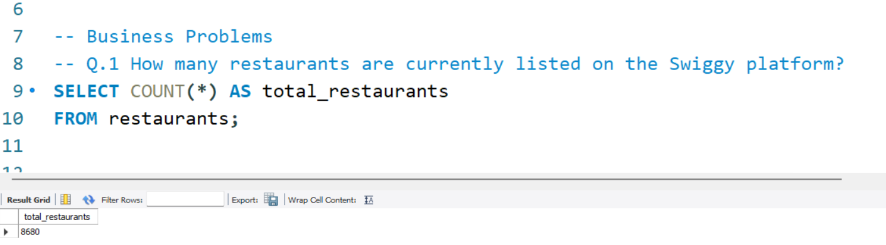

---

## Business Problem 2
### Identify which cities have the highest number of restaurants listed on the platform

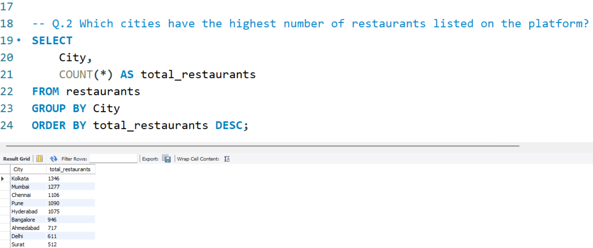

---

## Business Problem 3
### Identify the cities with the highest and lowest average delivery times

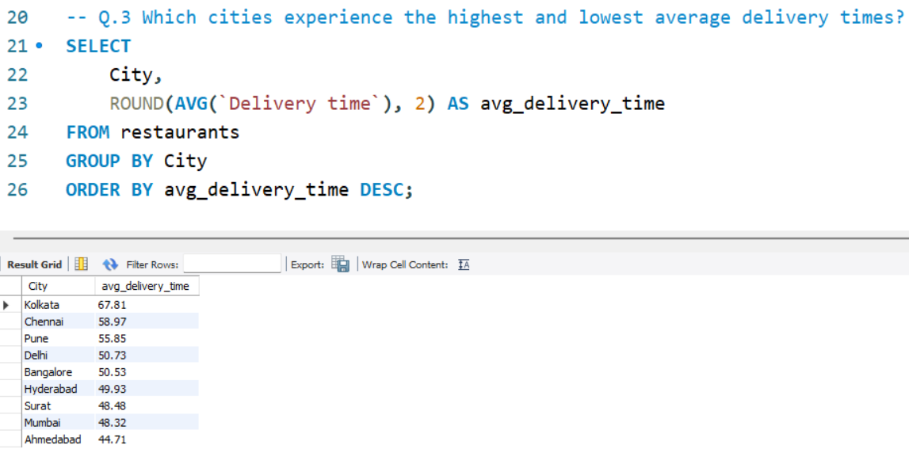

---

## Business Problem 4
### Find the restaurants with the highest average order pricing


---

## Business Problem 5
### Find the restaurants with the highest customer ratings

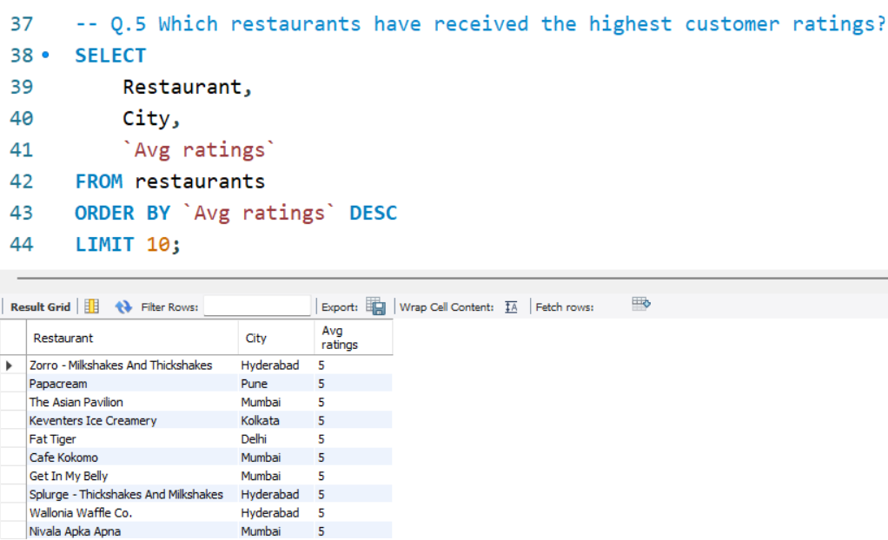

---

## Business Problem 6
### Identify which cities have the highest average restaurant pricing

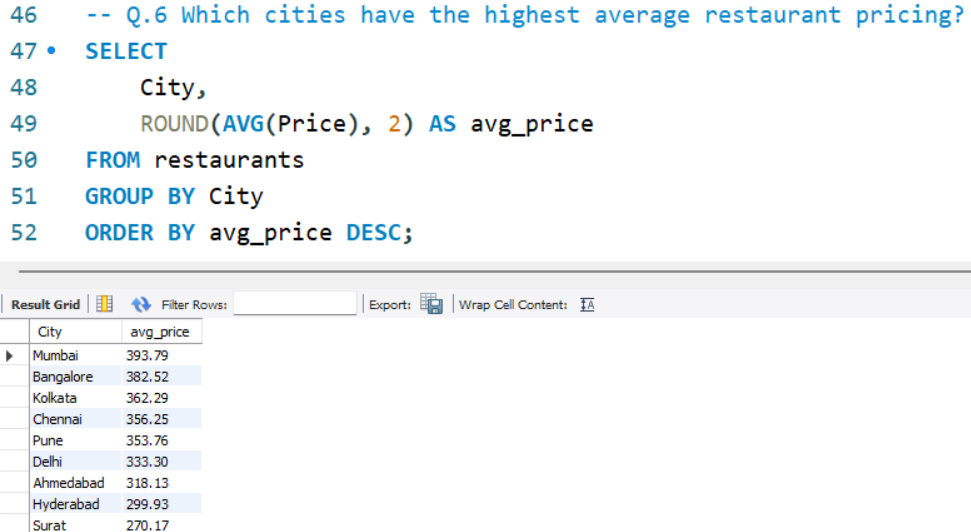

---

## Business Problem 7
### Find cities that have more than 1000 restaurants listed on the platform

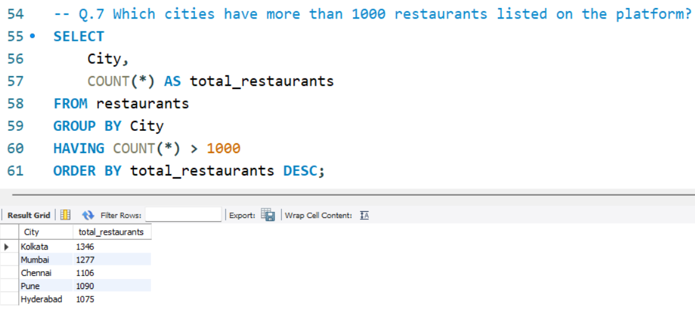

---

## Business Problem 8
### Identify restaurants that maintain both high ratings and high customer engagement

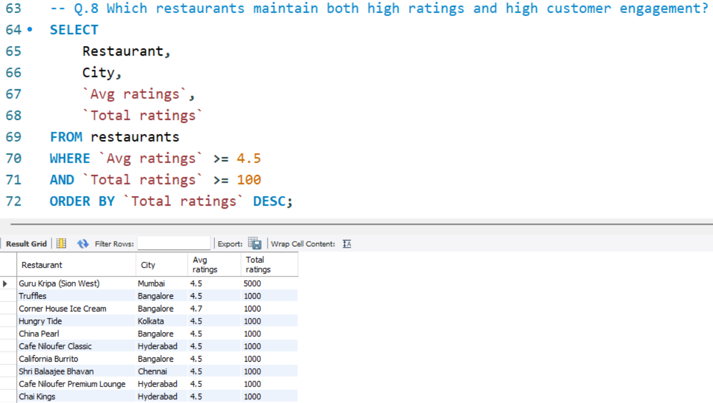

---

## Business Problem 9
### Find the restaurants that provide the fastest delivery service

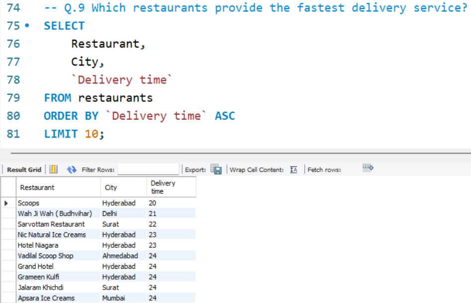

---

## Business Problem 10
### Categorize restaurants based on pricing levels (Budget / Mid-Range / Premium)

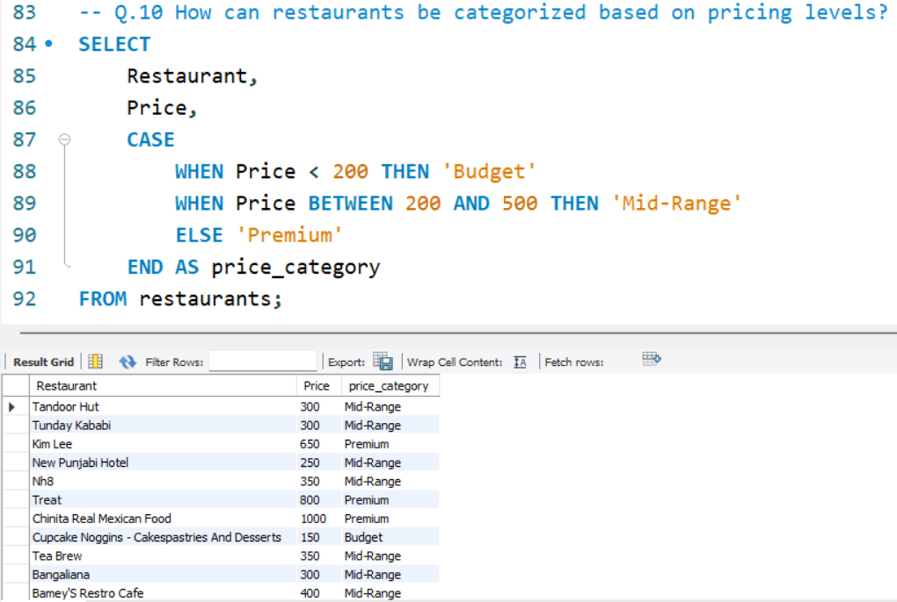

---

## Business Problem 11
### Rank restaurants within their respective cities based on customer ratings

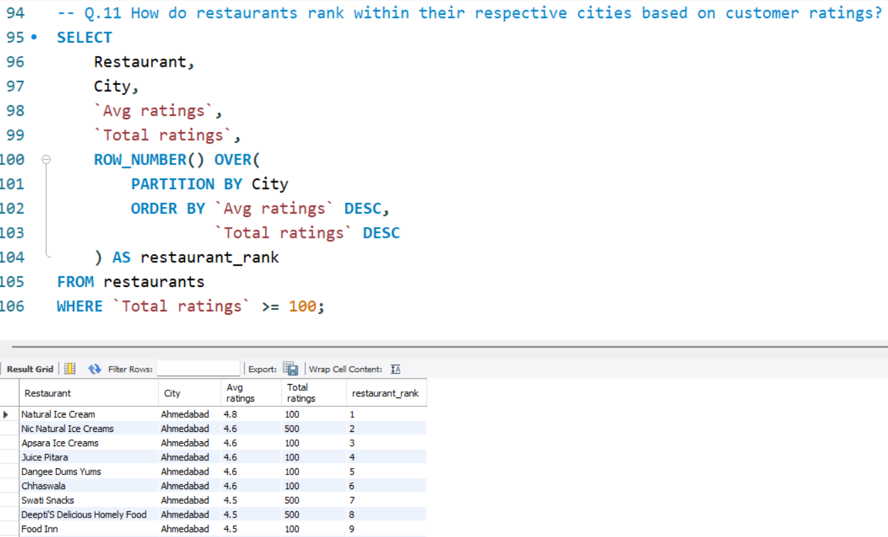

---

## Business Problem 12
### Find the top 3 performing restaurants in every city

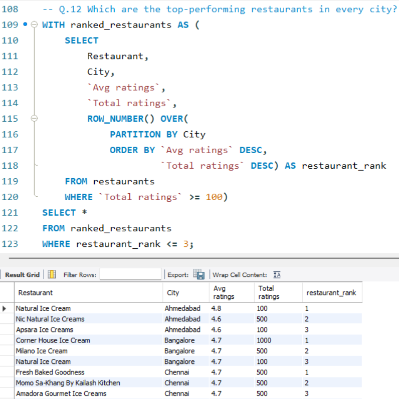

---

## Business Problem 13
### Compare each restaurant's pricing against the average pricing of its city

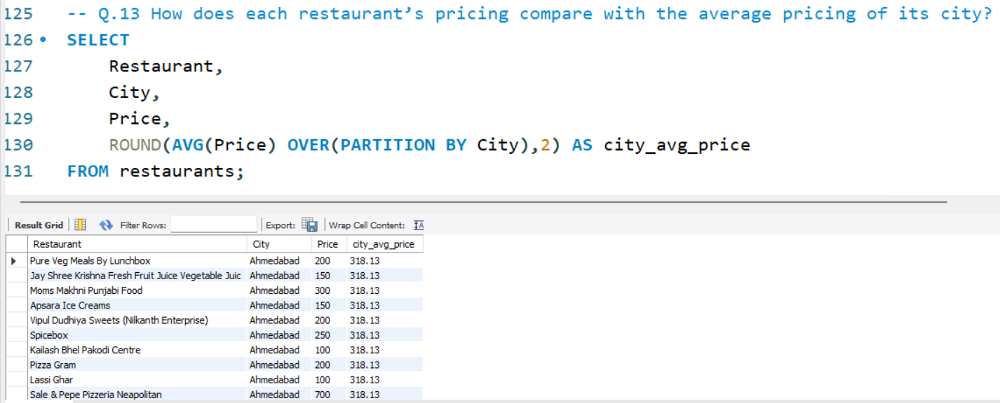

---

## Business Problem 14
### Identify restaurants that perform better than their city's average customer rating

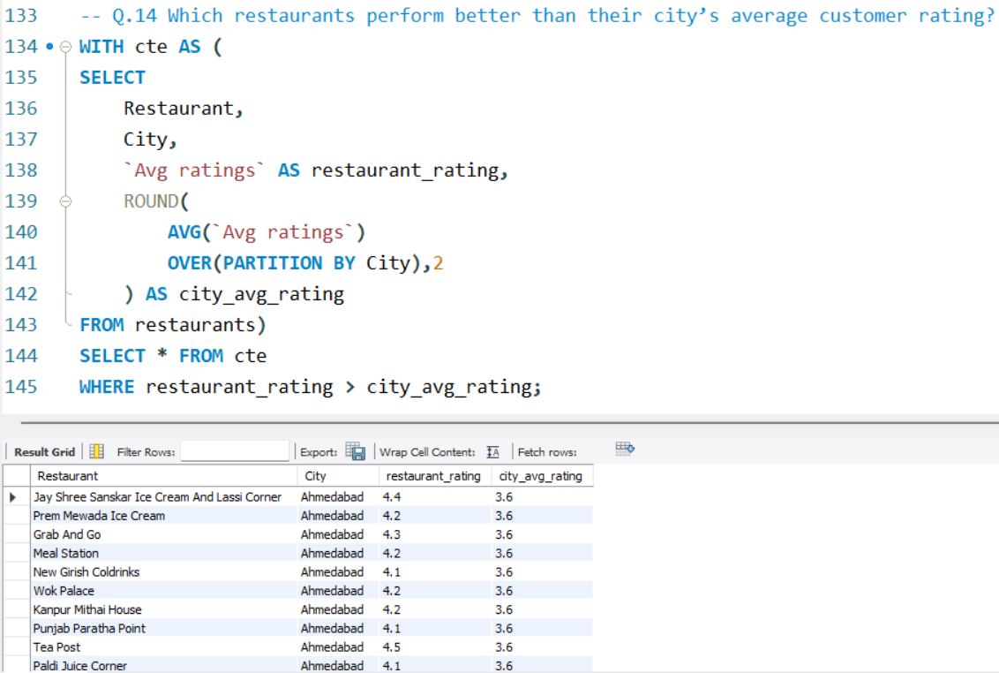

---

## Business Problem 15
### Rank restaurants by highest customer engagement based on total ratings

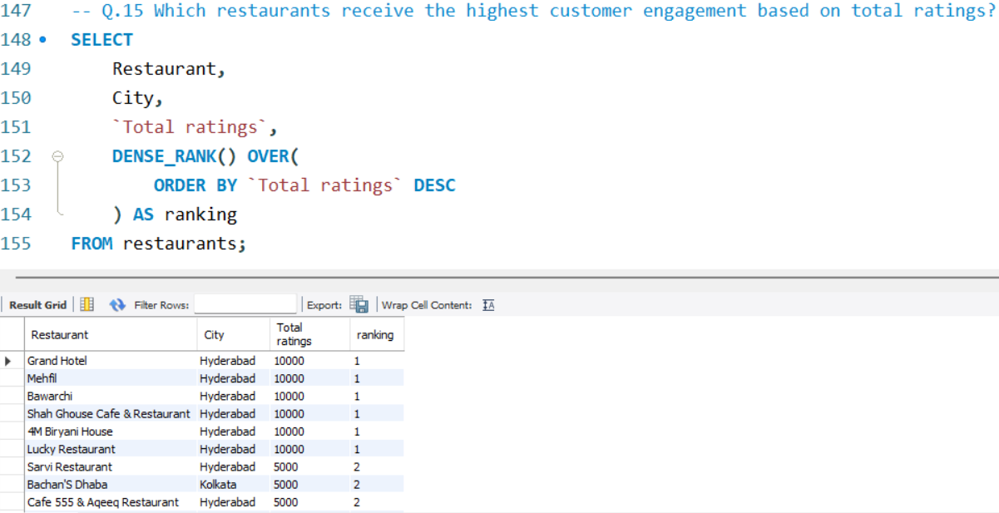

---

## Dashboard Preview

### Executive Overview


### Restaurant Performance


### City Analysis


### Cuisine Analysis

## Future Enhancements

Possible extensions to this project:
- Real-time data pipeline integration for live Swiggy data ingestion.
- Predictive modeling to forecast delivery times and restaurant ratings.
- Additional data sources such as competitor platforms for benchmarking.

---

## License

This project is licensed under the MIT License.

---

## Acknowledgments

- **Data Source**: Swiggy Restaurant Dataset
- **Dashboard**: Designed and developed in Microsoft Power BI
- **Inspiration**: Real-world food delivery analytics and operational efficiency use cases.
